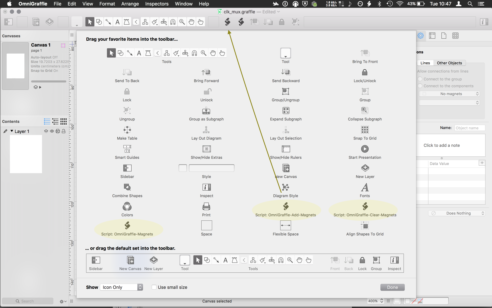
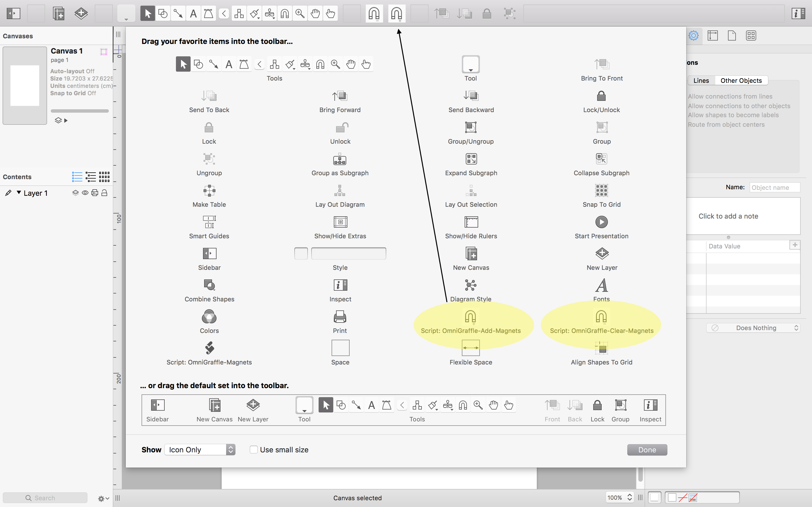

# OmniGraffle-Scripts
Set of scripts for use with omni graffle

1. [OmniGraffle-Magnets.scpt][] by Laurence Scotford allows any number of magnets to be added on a per side basis, inculding corners or not.

2. [OmniGraffle-Clear-Magnets.scpt][] Clears all magnets from selected shape.

3. [OmniGraffle-Add-Magnets.scpt][] Append magnets to selected shape **without** clearing them first.

--
Using scripts with OmniGraffle.
Help -> Open scripts folder. Will be something similiar to `~/Library/Application Scripts/com.omnigroup.OmniGraffle6`

Any script placed in here will be able to be added to the toolbar.

--

Replacing Icons
--
To make the icons in the toolbar a little more useful first create the icon, (drag-drop a png to [https://iconverticons.com/online/](https://iconverticons.com/online/) ) 'icns (finder ready)' worked for me.

Got to the scrips folder (omnigraffle Help -> Open scripts folder), 'Get Info' (cmd-i) on the script.

Drag and drop your created icon file into the top left of the get info window, over the current icon.

Now remove scripts from the omnigraffle toolbar, then re-apply and the new icons should be displayed in the toolbar.

--
[OmniGraffle 6 Mannual](http://files.omnigroup.com/software/MacOSX/Manuals/omnigraffle-6-manual.pdf)

[OmniGraffle-Magnets.scpt]: OmniGraffle-Magnets.scpt
[OmniGraffle-Clear-Magnets.scpt]: OmniGraffle-Clear-Magnets.scpt
[OmniGraffle-Add-Magnets.scpt]: OmniGraffle-Add-Magnets.scpt
